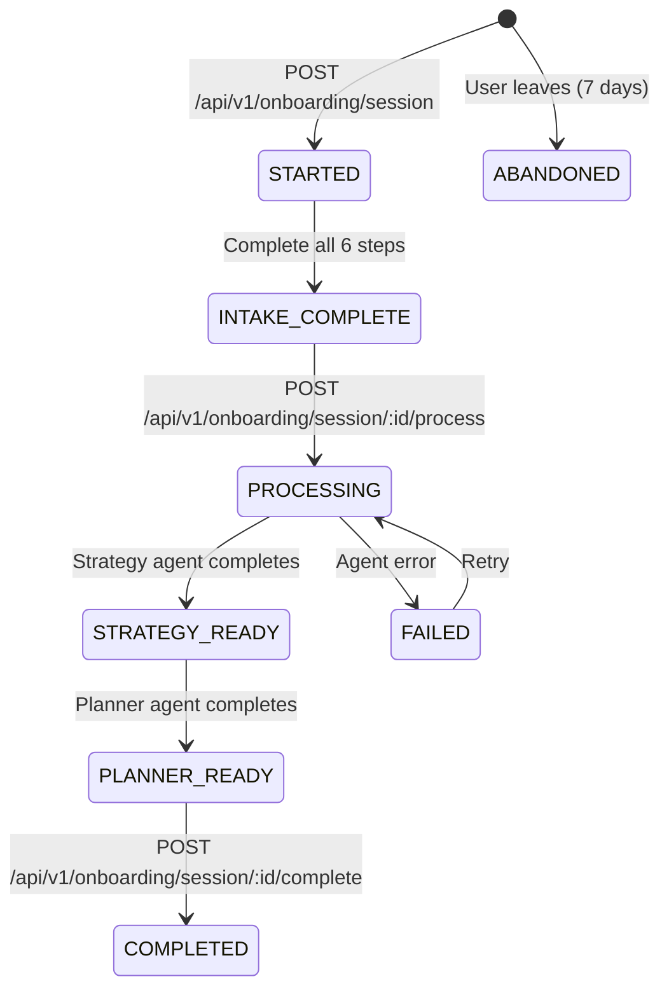

# Pravado Onboarding - Canonical Specification

**Version:** 2.0
**Feature Flag:** `ONBOARDING_V2=true`
**Owner:** Platform Team
**Last Updated:** 2025-11-07

---

## Executive Summary

This document defines the canonical onboarding experience for Pravado. The onboarding flow collects business information through a 6-step intake wizard, processes the data using AI agents (strategy + planner), and delivers a complete PR/content/SEO strategy plan.

**Prior State:** Two conflicting onboarding systems existed:
1. Trial onboarding wizard (Sprint 73) - 4 steps, org setup focused
2. Intake onboarding wizard - 6 steps, AI strategy generation

**Canonical Decision:** The **Intake Onboarding Wizard** is the canonical flow. Trial onboarding wizard will be removed.

---

## User Journey

```
┌─────────────────┐
│ User arrives at │
│ /onboarding     │
└────────┬────────┘
         │
         ▼
┌─────────────────────────────────────────┐
│ PHASE 1: Intake Wizard (6 steps)       │
│ - Business Info                         │
│ - Goals                                 │
│ - Competitors                           │
│ - Brand Voice                           │
│ - Channels                              │
│ - Regions                               │
└────────┬────────────────────────────────┘
         │ [All steps complete]
         ▼
┌─────────────────────────────────────────┐
│ PHASE 2: AI Processing                 │
│ - Strategy Agent generates plan         │
│ - Planner Agent creates content         │
│ - User sees progress screen             │
└────────┬────────────────────────────────┘
         │ [Processing complete]
         ▼
┌─────────────────────────────────────────┐
│ PHASE 3: Results Screen                │
│ - Strategy plan preview                 │
│ - Content calendar                      │
│ - Press release draft                   │
│ - SEO audit                             │
│ - CTA: "Go to Dashboard"                │
└─────────────────────────────────────────┘
```

---

## Status Transitions



**Status Enum:**
- `STARTED` - Session created, wizard not completed
- `INTAKE_COMPLETE` - All 6 steps submitted
- `PROCESSING` - Strategy agent running
- `STRATEGY_READY` - Strategy plan generated, planner starting
- `PLANNER_READY` - Planner agent completed
- `COMPLETED` - User acknowledged results
- `FAILED` - Agent execution failed (retryable)
- `ABANDONED` - Session inactive for 7+ days

---

## Intake Steps

### Step 1: Business Info (`BUSINESS_INFO`)

**Fields:**
- `businessName` (string, required, max 255)
- `industry` (string, required, max 255)
- `website` (URL, required, max 500)
- `companySize` (enum: SOLO | SMALL | MEDIUM | LARGE | ENTERPRISE, optional)
- `foundedYear` (number 1800-2025, optional)

**Validation:** `BusinessInfoSchema` (Zod)

---

### Step 2: Goals (`GOALS`)

**Fields:**
- `primaryGoals` (string[], min 1, max 10, required)
- `successMetrics` (string[], min 1, max 10, required)
- `timeline` (string, optional)
- `budgetRange` (string, optional)

**Validation:** `GoalsSchema` (Zod)

---

### Step 3: Competitors (`COMPETITORS`)

**Fields:**
- `competitors` (array of Competitor objects, min 1, max 10, required)
  - `name` (string, required)
  - `website` (URL, optional)
  - `strengths` (string, optional)
- `marketPosition` (enum: LEADER | CHALLENGER | FOLLOWER | NICHE, optional)
- `uniqueValueProposition` (string, min 10, max 1000, required)

**Validation:** `CompetitiveInfoSchema` (Zod)

---

### Step 4: Brand Voice (`BRAND_VOICE`)

**Fields:**
- `brandTone` (string[], min 1, max 10, required)
- `brandAttributes` (string[], min 1, max 10, required)
- `targetAudience` (object, optional)
  - `demographics` (ageRange, location, jobTitles, industries)
  - `psychographics` (interests, challenges, goals)
  - `painPoints` (string[])
- `brandPersonality` (string, max 1000, optional)

**Validation:** `BrandVoiceSchema` (Zod)

---

### Step 5: Channels (`CHANNELS`)

**Fields:**
- `prPriority` (number 1-5, required)
- `contentPriority` (number 1-5, required)
- `seoPriority` (number 1-5, required)
- `preferredContentTypes` (string[], min 1, required)

**Validation:** `ChannelPrioritiesSchema` (Zod)

---

### Step 6: Regions (`REGIONS`)

**Fields:**
- `primaryRegions` (string[], min 1, required)
- `languages` (string[], min 1, required)
- `localConsiderations` (string, max 1000, optional)
- `additionalContext` (string, max 2000, optional)
- `challenges` (string[], max 20, optional)
- `existingAssets` (object, optional)
  - `hasWebsite`, `hasBlog`, `hasSocialMedia`, `hasPressCoverage`, `hasEmailList` (booleans)

**Validation:** `GeographicTargetingSchema.merge(AdditionalContextSchema)` (Zod)

---

## API Contract (4 Endpoints)

### 1. `POST /api/v1/onboarding/session`

**Purpose:** Create new onboarding session
**Auth:** Required (JWT)
**Rate Limit:** 5 requests/hour per organization

**Request:**
```json
{
  "organizationId": "uuid",
  "userId": "uuid"
}
```

**Response (201):**
```json
{
  "id": "uuid",
  "organizationId": "uuid",
  "userId": "uuid",
  "status": "STARTED",
  "currentStep": "BUSINESS_INFO",
  "completedSteps": [],
  "startedAt": "2025-11-07T10:00:00Z",
  "createdAt": "2025-11-07T10:00:00Z",
  "updatedAt": "2025-11-07T10:00:00Z"
}
```

**Validation:**
- Organization must be on TRIAL tier
- No existing onboarding session for organization
- Zod: `CreateOnboardingSessionInputSchema`

**Errors:**
- `403` - Organization not on trial tier or session exists
- `401` - Unauthorized

---

### 2. `POST /api/v1/onboarding/session/:id/intake`

**Purpose:** Submit intake step data (called 6 times, once per step)
**Auth:** Required (JWT)
**Rate Limit:** 60 requests/hour per session

**Request:**
```json
{
  "step": "BUSINESS_INFO",
  "data": {
    "businessName": "Acme Corp",
    "industry": "SaaS",
    "website": "https://acme.com",
    "companySize": "SMALL",
    "foundedYear": 2020
  }
}
```

**Response (200):**
```json
{
  "id": "uuid",
  "sessionId": "uuid",
  "step": "BUSINESS_INFO",
  "data": { /* echoed data */ },
  "createdAt": "2025-11-07T10:05:00Z",
  "updatedAt": "2025-11-07T10:05:00Z"
}
```

**Side Effects:**
- Marks step as completed in `session.completedSteps`
- Advances `session.currentStep` to next step
- When all 6 steps completed, sets `session.status = INTAKE_COMPLETE`

**Validation:**
- Zod schema based on `step` value (via `getStepValidationSchema()`)
- Session must exist and belong to user's organization
- Step must not be already completed (allow overwrites)

**Errors:**
- `400` - Validation failed
- `404` - Session not found
- `401` - Unauthorized

---

### 3. `POST /api/v1/onboarding/session/:id/process`

**Purpose:** Trigger AI processing (strategy + planner agents)
**Auth:** Required (JWT)
**Rate Limit:** 3 requests/hour per session

**Request:**
```json
{
  "autoStartPlanner": true  // If true, planner starts after strategy completes
}
```

**Response (202):**
```json
{
  "message": "Processing started",
  "strategyJobId": "uuid",
  "plannerJobId": "uuid",  // Only if autoStartPlanner=true
  "estimatedCompletionTime": "2025-11-07T10:15:00Z"
}
```

**Side Effects:**
- Sets `session.status = PROCESSING`
- Sets `session.processingStartedAt = now()`
- Enqueues strategy agent job
- Stores `session.strategyTaskId`
- If `autoStartPlanner=true`, enqueues planner job after strategy completes

**Validation:**
- Session must have `status = INTAKE_COMPLETE`
- All 6 steps must be completed

**Errors:**
- `400` - Intake not complete
- `404` - Session not found
- `401` - Unauthorized
- `409` - Processing already in progress

---

### 4. `GET /api/v1/onboarding/session/:id/result`

**Purpose:** Get complete onboarding result (session + intake + AI outputs)
**Auth:** Required (JWT)
**Rate Limit:** 100 requests/hour per session

**Response (200):**
```json
{
  "session": {
    "id": "uuid",
    "status": "PLANNER_READY",
    "currentStep": "REGIONS",
    "completedSteps": ["BUSINESS_INFO", "GOALS", ...],
    "startedAt": "2025-11-07T10:00:00Z",
    "intakeCompletedAt": "2025-11-07T10:10:00Z",
    "processingStartedAt": "2025-11-07T10:11:00Z",
    "strategyGeneratedAt": "2025-11-07T10:13:00Z",
    "plannerCompletedAt": "2025-11-07T10:20:00Z",
    "completedAt": null
  },
  "intakeSummary": {
    "businessName": "Acme Corp",
    "industry": "SaaS",
    "primaryGoals": ["Increase brand awareness", "Generate leads"],
    "uniqueValueProposition": "AI-powered workflow automation",
    // ... all intake data aggregated
  },
  "strategy": {
    "strategyPlanId": "uuid",
    "plan": {
      "prStrategy": {
        "objectives": ["..."],
        "keyMessages": ["..."],
        "targetOutlets": ["TechCrunch", "VentureBeat"],
        "timeline": "6 months"
      },
      "contentStrategy": {
        "themes": ["..."],
        "contentPillars": ["..."],
        "cadence": "3x per week",
        "channels": ["blog", "linkedin"]
      },
      "seoStrategy": {
        "focusKeywords": ["workflow automation", "AI productivity"],
        "targetPages": ["/features", "/pricing"],
        "contentGaps": ["..."],
        "technicalPriorities": ["..."]
      }
    },
    "executionTimeMs": 8432
  },
  "planner": {
    "contentCalendar": {
      "contentIds": ["uuid1", "uuid2", "uuid3"],
      "items": [
        {
          "id": "uuid1",
          "title": "How AI Transforms Workflow Automation",
          "type": "blog_post",
          "scheduledDate": "2025-11-15"
        }
      ]
    },
    "pressRelease": {
      "id": "uuid",
      "title": "Acme Corp Launches AI-Powered Platform",
      "subtitle": "Revolutionary workflow automation..."
    },
    "seoAudit": {
      "id": "uuid",
      "url": "https://acme.com",
      "score": 78
    },
    "executionTimeMs": 12543
  }
}
```

**Polling:**
- Frontend should poll this endpoint every 2-3 seconds while `status` is `PROCESSING`, `STRATEGY_READY`, or `PLANNER_READY`
- Once `status = PLANNER_READY`, show results screen
- Use exponential backoff if agent takes > 30 seconds

**Validation:**
- Session must exist and belong to user's organization

**Errors:**
- `404` - Session not found
- `401` - Unauthorized

---

## Removed/Deprecated Endpoints

The following endpoints exist in the current implementation but will be **removed** in the consolidated API:

- ~~`GET /api/onboarding/sessions/current`~~ → Use session ID from creation response
- ~~`GET /api/onboarding/sessions/:id`~~ → Merged into `/result`
- ~~`GET /api/onboarding/sessions/:id/intake`~~ → Merged into `/result`
- ~~`GET /api/onboarding/sessions/:id/summary`~~ → Merged into `/result`
- ~~`POST /api/onboarding/sessions/:id/start-processing`~~ → Replaced by `/process`
- ~~`POST /api/onboarding/sessions/:id/start-planner`~~ → Auto-triggered by `/process`
- ~~`POST /api/onboarding/sessions/:id/complete`~~ → No longer needed (status auto-updates)

**Rationale:** Reduce API surface area, simplify client logic, consolidate data fetching.

---

## Frontend Architecture

### Components Hierarchy

```
/app/onboarding/page.tsx
├─ OnboardingWizard (CANONICAL)
│  ├─ StepIndicator
│  ├─ BusinessInfoStep
│  ├─ GoalsStep
│  ├─ CompetitorsStep
│  ├─ BrandVoiceStep
│  ├─ ChannelsStep
│  └─ RegionsStep
├─ OnboardingProgress
│  ├─ ProcessingAnimation
│  ├─ StrategyProgressBar
│  └─ PlannerProgressBar
└─ OnboardingResult
   ├─ StrategyPreview
   ├─ ContentCalendarPreview
   ├─ PressReleasePreview
   └─ SEOAuditPreview
```

### Removed Components

- ~~`TrialOnboardingWizard.tsx`~~ - DELETE (duplicate system)
- ~~`Step1OrgSetup`, `Step2ApiKeys`, `Step3FirstAgent`, `Step4UsageDemo`~~ - DELETE

---

## Hooks

### `useOnboarding()` - Primary Hook

**Location:** `apps/dashboard/src/hooks/useOnboarding.ts`

**API:**
```typescript
function useOnboarding() {
  return {
    // State
    session: OnboardingSession | null;
    isLoading: boolean;
    error: Error | null;

    // Actions
    createSession: () => Promise<OnboardingSession>;
    saveIntakeResponse: (step: IntakeStep, data: any) => Promise<void>;
    startProcessing: (autoStartPlanner: boolean) => Promise<void>;
    getResult: () => Promise<OnboardingResult>;

    // Polling
    pollInterval: 3000; // ms
  };
}
```

**Implementation:**
- Uses React Query for caching + polling
- Calls 4 canonical API endpoints
- Handles error states
- Manages loading states

### Removed Hooks

- ~~`useTrialOnboarding()`~~ - DELETE
- ~~`useOnboardingState()`~~ - DELETE
- ~~`useTrialStatus()`~~ - DELETE
- ~~`useCompleteStep()`~~ - DELETE
- ~~`useOnboardingProgress()`~~ - DELETE

---

## Database Schema

**Tables:**
- `onboarding_sessions` - Main session state
- `intake_responses` - Intake step data (6 rows per session)
- `onboarding_agent_results` - Strategy + planner outputs
- `strategy_plans` - Generated strategy plans (linked)

**No changes required** - existing schema already supports canonical flow.

---

## Validation Rules

**All validation uses Zod schemas from `packages/validators/src/schemas/onboarding.schema.ts`**

**Server-Side:**
- API validates all inputs with Zod before persistence
- Returns 400 with detailed error messages

**Client-Side:**
- Dashboard uses same Zod schemas (no validators import!)
- Copy schemas to `apps/dashboard/src/schemas/onboarding.ts` (duplicated intentionally)
- React Hook Form + Zod resolver for inline validation

**Validation Sharing Strategy:**
- Types: `@pravado/types` (shared)
- Validators: `@pravado/validators` (API only)
- Dashboard: Copy Zod schemas locally to avoid circular deps

---

## Feature Flag

**Flag:** `ONBOARDING_V2`
**Default:** `false`
**Rollout Plan:**
1. Deploy with flag `false` (old system active)
2. Enable for internal testing (`ONBOARDING_V2=true`)
3. Enable for 10% of trial users (A/B test)
4. Gradual rollout to 100%
5. Remove flag + old code after 30 days

**Implementation:**
```typescript
// .env
ONBOARDING_V2=true

// Feature flag check
if (process.env.ONBOARDING_V2 === 'true') {
  // Use canonical onboarding
  return <OnboardingWizard />;
} else {
  // Fallback (or show maintenance message)
  return <MaintenanceScreen />;
}
```

---

## Testing Requirements

### E2E Tests (Playwright)

**File:** `apps/dashboard/e2e/onboarding.spec.ts`

**Test Cases:**
1. Happy path: Complete all 6 steps → Process → View results
2. Validation errors: Submit invalid data at each step
3. Persistence: Refresh page mid-wizard, resume from current step
4. Processing errors: Simulate agent failure, retry
5. Abandonment: Check session expires after 7 days
6. Duplicate prevention: Cannot create 2nd session for same org

### Contract Tests (API)

**File:** `apps/api/tests/onboarding.contract.test.ts`

**Test Cases:**
1. POST `/session` - Validate response shape matches `OnboardingSession` type
2. POST `/intake` - Validate each step accepts correct schema
3. POST `/process` - Validate job IDs returned
4. GET `/result` - Validate complete result structure
5. Error responses - Validate error shapes (400, 401, 403, 404, 409)

### Unit Tests

**Coverage Target:** 80%
- `onboarding.service.ts` - Business logic
- `onboarding.controller.ts` - Request handling
- `useOnboarding.ts` - Hook logic
- Validation schemas - Edge cases

---

## CI/CD Guards

**Architectural Violation Prevention:**

```yaml
# .github/workflows/ci.yml
- name: Check architectural boundaries
  run: |
    # Dashboard must NOT import @pravado/validators
    if grep -r "@pravado/validators" apps/dashboard/src; then
      echo "ERROR: Dashboard importing validators (forbidden)"
      exit 1
    fi

    # No commented-out code allowed
    if grep -r "// REMOVE ME" apps/; then
      echo "ERROR: Commented code found"
      exit 1
    fi
```

---

## Migration Checklist

- [ ] Create canonical spec (this document)
- [ ] Delete `TrialOnboardingWizard.tsx` and related components
- [ ] Delete trial onboarding hooks (5 hooks)
- [ ] Implement 4 consolidated API endpoints
- [ ] Deprecate 6 old API endpoints (with 30-day sunset)
- [ ] Implement `useOnboarding()` hook (replace stub)
- [ ] Create 6 step components (BusinessInfoStep, etc.)
- [ ] Create StepIndicator component
- [ ] Create OnboardingProgress component
- [ ] Create OnboardingResult component
- [ ] Copy Zod schemas to `apps/dashboard/src/schemas/onboarding.ts`
- [ ] Write E2E tests (6 test cases)
- [ ] Write contract tests (5 test cases)
- [ ] Add feature flag `ONBOARDING_V2`
- [ ] Add CI guards for architectural violations
- [ ] Generate verification report
- [ ] Deploy preview environment
- [ ] QA testing
- [ ] Gradual rollout

---

## Design Tokens

**Follow `docs/design_system.md`:**

**Spacing:**
- Step padding: `spacing.lg` (32px)
- Button margins: `spacing.md` (16px)
- Section gaps: `spacing.xl` (48px)

**Typography:**
- Step title: `typography.h2`
- Field labels: `typography.bodyMd`
- Validation errors: `typography.bodySm` + `colors.error`

**Colors:**
- Primary CTA: `colors.primary`
- Secondary button: `colors.neutral.200`
- Error state: `colors.error`
- Success state: `colors.success`

---

## Acceptance Criteria

1. Only ONE wizard exists (`OnboardingWizard.tsx`)
2. Only 4 API endpoints exist (`/session`, `/intake`, `/process`, `/result`)
3. All intake steps use Zod validation
4. E2E tests pass (6 test cases, 100% success)
5. Contract tests pass (5 test cases, 100% success)
6. Feature flag `ONBOARDING_V2` controls rollout
7. CI guards prevent architectural violations
8. No commented-out code in codebase
9. Verification report generated with 100% pass rate
10. Preview URL deployed and functional

---

## Success Metrics

**Technical:**
- API response time < 200ms (p95)
- E2E test suite runtime < 5 minutes
- Zero TypeScript errors in dashboard
- Zero console errors in browser

**Product:**
- > 80% of users complete all 6 intake steps
- < 10% abandonment rate during wizard
- > 90% satisfaction with AI-generated strategy
- Average completion time < 15 minutes

---

## Related Documents

- `/docs/design_system.md` - UI/UX guidelines
- `/docs/architecture.md` - Platform architecture
- `/docs/agent_framework.md` - AI agent system
- `/packages/types/src/onboarding.ts` - Type definitions
- `/packages/validators/src/schemas/onboarding.schema.ts` - Validation schemas

---

**End of Specification**
